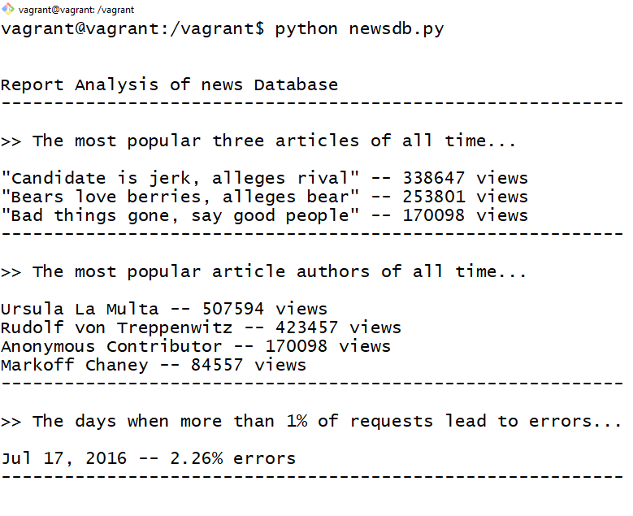

# Logs Analysis Project

This project is a part of [Full Stack Web Developer Nanodegree Program](https://in.udacity.com/course/full-stack-web-developer-nanodegree--nd004). This project is about to create a reporting tool that prints out reports (in plain text) based on the data in the database. This reporting tool is a Python program using the psycopg2 module to connect to the database.

## Table of contents

* [Objective of project](#objective-of-project)
* [Project files details](#project-files-details)
* [Project data structure](#project-data-structure)
* [Download and setup project](#download-and-setup-project)
* [How to run project](#how-to-run-project)
* [Demo of project](#demo-of-project)

## Objective of project

The main objective of this project is to build an internal reporting tool that will use information from the database to discover what kind of articles the site's readers like.

The program in this project will run from the command line. It will connect to the database, use SQL queries to analyze the log data, and print out the answers to some questions.

## Project files details

In this project, there are main 3 files which are...

1. <span>newsdb.py</span>
2. reports.txt
3. <span>README.md</span>

There is a <span>newsdb.py</span> file which includes the main source code to connect to the database and to generate reports.

The file reports.txt is a plain text file that is a copy of what our program printed out.

The file <span>README.md</span> is a Markdown text file in which user describe the design of code and how to run it.

## Project data structure

In this project, the file <span>newsdb.py</span> includes functions to create a view according to the analysis of the database. Here are the questions the reporting tool will answer.

1. What are the most popular three articles of all time?

```python
def articles_view():
    """ this function creates a view for the most popular
        articles of all time.
    """

    db, c = connect()
    query = "create or replace view articles_view as \
            (select title, count(*) as num from articles, log \
            where log.path like concat('%', articles.slug, '%') \
            and log.status like '%200%' \
            group by articles.title \
            order by num desc \
            limit 3);"
    c.execute(query)
    db.commit()
    db.close()
```

2. Who are the most popular article authors of all time?

```python
def authors_view():
    """ this function creates a view for the most popular 
        article authors of all time.
    """

    db, c = connect()
    query = "create or replace view authors_view as \
            (select authors.name, count(*) as num \
            from articles, authors, log \
            where articles.author = authors.id \
            and log.path like concat('%', articles.slug, '%') \
            and log.status like '%200%' \
            group by authors.name \
            order by num desc);"
    c.execute(query)
    db.commit()
    db.close()
```

3. On which days did more than 1% of requests lead to errors?

```python
def log_view():
    """ this function creates a view for the error log.
    """

    db, c = connect()
    query = "create or replace view log_view as \
            (select * from \
            (select to_char(time, 'Mon DD, YYYY') as day, \
            round((sum(case log.status when '200 OK' then 0 else 1 end) \
            * 100.0) / count(log.status), 2) as error_per \
            from log \
            group by day \
            order by error_per desc) as result \
            where error_per > 1);"
    c.execute(query)
    db.commit()
    db.close()
```

## Download and setup project

To run this project, a user needs to set up following things step by step...

* Install Vagrant and VirtualBox to run this project beacause, this project makes use of the Linux-based virtual machine (VM).
* Download the database file from [here](https://d17h27t6h515a5.cloudfront.net/topher/2016/August/57b5f748_newsdata/newsdata.zip) and Unzip it. Here user will found newsdata.sql file.
* Launch Virtual Machine inside the vagrant sub-directory using the following command into the command line.

```bash
vagrant up
```

* Use the following command to login into it.

```bash
vagrant ssh
```

* To load the data of the database, a user should use the following command.

```bash
psql -d news -f newsdata.sql
```

## How to run project

To run this project, a user should run the following command into the command line.

```bash
python newsdb.py
```

This command will run the python programme which is the main reporting tool that will print out the reports.

## Demo of project

